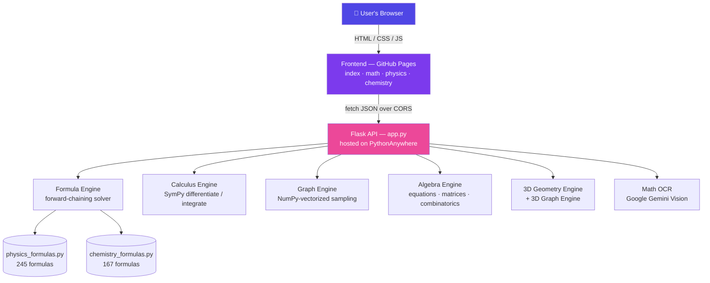

<div align="center">


[;Bilingual+%C2%B7+Light%2FDark+%C2%B7+Mobile-First+UI)](https://git.io/typing-svg)

<p>
  
  
  
  
  
</p>
<p>
  
  
  
  
  
</p>
<p>
  
  
</p>

<p>
  
  
  
</p>

**[🌐 Live Site](https://duttaanubhab777-code.github.io/Friendly-Flux/frontend/)** &nbsp;·&nbsp;
**[🔗 Live API](https://friendlyflux.pythonanywhere.com/api/health)** &nbsp;·&nbsp;
**[🐛 Report an Issue](../../issues)**

</div>


## 📖 Overview

**Friendly Flux** is a full-stack STEM problem-solving platform that pairs a **symbolic-math Flask API** with a **lightweight, framework-free frontend**. It's built for students who want more than a plain calculator — it *shows the working*.

Instead of one big monolithic solver, the backend is split into **seven independent engines**, each specialized for one domain (calculus, algebra, 3D geometry, physics/chemistry formulas, graphing, and image-based OCR), all orchestrated behind a single Flask app and consumed by a bilingual, mobile-first web UI.

> Point it at a differentiation problem, a system of linear equations, a 3D-geometry angle-between-planes question, a physics "find the unknown" problem, or a photo of a handwritten expression — Friendly Flux figures out *how* to solve it, not just *what* the answer is.

<div align="center">

|  | 3 | 10 | 412+ | 7 | 6,000+ |
|:---:|:---:|:---:|:---:|:---:|:---:|
| | **Subjects** | **API Endpoints** | **Physics + Chemistry Formulas** | **Solver Engines** | **Lines of Python** |

</div>

---

## 📑 Table of Contents

- [Overview](#-overview)
- [Features](#-features)
  - [Mathematics](#-mathematics)
  - [Physics](#-physics)
  - [Chemistry](#-chemistry)
  - [Frontend Experience](#-frontend-experience)
- [Architecture](#%EF%B8%8F-architecture)
- [Tech Stack](#-tech-stack)
- [Project Structure](#-project-structure)
- [Getting Started](#-getting-started)
- [API Reference](#-api-reference)
- [Security & Reliability](#%EF%B8%8F-security--reliability)
- [Roadmap](#%EF%B8%8F-roadmap)
- [Credits](#-credits)
- [License](#-license)


## ✨ Features

### 📐 Mathematics

Mathematics is the deepest module, made of four independent engines that all live under one **Calculus Solver** page (`math.html`) with a tabbed UI:

| Engine | What it does |
|---|---|
| **Calculus Engine** | True symbolic differentiation (1st–6th order, mixed partials like `∂²/∂x∂y`) and integration (definite & indefinite), powered by [SymPy](https://www.sympy.org/) — exact simplified results, never decimal approximations. Automatically detects non-elementary (no closed-form) integrals. |
| **Algebra Engine** | A full symbolic algebra suite: expression simplification; linear, quadratic & polynomial equations; systems of equations (with Cramer's-rule / matrix working shown); inequalities (simple, compound, absolute-value, rational); rational/radical/exponential/logarithmic equations; complex-number arithmetic; parametric (symbolic-coefficient) equations; **matrix operations** (determinant, inverse, rank, eigenvalues, `A × B`, `Aⁿ`); and **permutations & combinations**. Every result is rendered in both plain text and LaTeX. |
| **3D Geometry Engine** | Classic "3D Geometry" chapter problems — distance between points, section formula, direction ratios/cosines, equations of lines & planes, angle between line-line / plane-plane / line-plane, foot of perpendicular, reflection, coplanarity, and line–plane intersection — via `sympy.geometry`, with an accompanying **3D Graph Engine** that renders the same objects as interactive Plotly-style plots. |
| **Graph Engine** | Numerically samples any single-variable expression (`sin(x)`, `e^(-x²)`, `1/x`, …) with `sympy.lambdify` → vectorized NumPy evaluation, so even large point counts render instantly. Falls back to a slower, reliable per-point method for the rare function that can't be vectorized. |
| **Math OCR** | Snap a photo of a handwritten or printed expression and Friendly Flux transcribes it straight into the calculator's syntax using **Google Gemini's vision model** — no separate LaTeX-to-syntax conversion step required. |

### 🚀 Physics

- A shared **hybrid forward-chaining formula engine**: give it whatever values you already know, and it automatically figures out *which* formulas apply and *in what order* to reach your target variable — showing every intermediate step. Includes an auto-deadlock breaker for simultaneous-equation cases where straightforward forward chaining stalls.
- **Two input modes** on the Physics page: a guided **Basic** picker, and a free-form **Smart Solver** where you type in any known variables and pick a target — the engine does the rest.
- **245 formulas** spanning Kinematics, Newton's Laws, Work-Energy-Power, Momentum & Collisions, Circular Motion, Gravitation, Rotational Motion, SHM, Waves, Elasticity & Fluids, Thermal Physics, Ray & Wave Optics, Electrostatics, Current Electricity, Magnetism & EMI, Alternating Current, and Modern Physics.

### 🧪 Chemistry

- Same forward-chaining solver engine as Physics, applied to **167 formulas** covering Mole Concept & Stoichiometry, Atomic Structure, Gaseous State, Thermochemistry & Thermodynamics, Chemical Equilibrium (incl. pH/pKa/buffers), Solutions & Colligative Properties, Electrochemistry, Chemical Kinetics, Surface Chemistry, and Redox/Equivalent Concept.
- Formulas are defined as plain algebraic strings (e.g. `"pH = -log10(H)"`) and parsed symbolically with SymPy, so extending coverage never requires hand-written solver logic.

### 🌐 Frontend Experience

- **Pure HTML / CSS / vanilla JavaScript** — zero build step, zero framework, deployable as static files to any host (currently GitHub Pages).
- **Bilingual UI** (English / বাংলা) with a single toggle, powered by a per-subject `lang.js` dictionary so new subjects can be added without touching existing translations.
- **Light/Dark theme** with a shared custom target-select modal replacing native `<select>` dropdowns for a more app-like feel.
- **Mobile-first design** with a categorized on-screen keypad — the entire project was written and is meant to be used from a phone, so no feature depends on a physical keyboard.
- **Ambient animated canvas background** (`science-bg.js`) — a purely decorative, theme-aware particle/orbit animation layered behind every page.
- **"Legends of Science" Hall of Fame** on the landing page, generated from `scientists.json`.
- **Live client-side validation** (bracket balance, character allow-listing) before a request ever reaches the API, so obviously-invalid input never wastes a round trip.
- Results rendered with **MathJax** for properly typeset mathematical notation, and **Chart.js** for graphs.

---

## 🏗️ Architecture



---

## 🧰 Tech Stack

<div align="center">

| Layer | Technology |
|---|---|
| **Backend** |      |
| **AI / OCR** |  |
| **Frontend** |       |
| **Deployment** |   |

</div>

---

## 📁 Project Structure

```text
Friendly-Flux/
├── Backend/
│   ├── app.py                          # Flask app — every API route lives here
│   ├── requirements.txt                # Python dependencies
│   ├── engines/
│   │   ├── calculus_engine.py          # Differentiation / integration (SymPy)
│   │   ├── graph_engine.py             # Numerical sampling for the Graph tool
│   │   ├── formula_engine.py           # Forward-chaining solver (Physics & Chemistry)
│   │   ├── geometry3d_engine.py        # 3D geometry calculations
│   │   ├── geometry3d_graph_engine.py  # 3D geometry → Plotly-style plot data
│   │   ├── math_ocr.py                 # Image → expression (Gemini Vision)
│   │   └── algebra_engines/
│   │       ├── algebra_engine.py       # Dispatcher — classifies & routes a problem
│   │       ├── algebra_core.py         # Shared parsing, timeouts, security guards
│   │       ├── algebra_matrix.py       # Matrix / determinant / eigenvalue operations
│   │       └── algebra_render.py       # Dual plain-text + LaTeX step rendering
│   └── formulas/
│       ├── physics_formulas.py         # 245 physics formulas
│       └── chemistry_formulas.py       # 167 chemistry formulas
│
└── frontend/
    ├── index.html, style.css, script.js, shared.js   # Landing page + shared app logic
    ├── science-bg.js / science-bg.css                # Ambient animated background
    ├── scientists.json                                # "Hall of Fame" data
    ├── math/
    │   ├── math.html                   # Calculus Solver page (tabbed: Calc/Algebra/3D)
    │   ├── core/                       # Calculus tool (math.js, lang.js, math.css)
    │   ├── algebra/                    # Algebra tool
    │   ├── geometry/                   # 3D Geometry tool
    │   └── welcome/                    # Math subject landing page
    ├── physics/                        # Physics Solver page (Basic + Smart modes)
    └── chemistry/                      # Chemistry Solver page
```

---

## 🚀 Getting Started

### Prerequisites

- Python **3.10+**
- Any modern browser (a physical keyboard is *not* required — the UI is keypad-driven)
- *(Optional, for Math OCR only)* A [Google Gemini API key](https://ai.google.dev/)

### 1 · Clone the repository

```bash
git clone https://github.com/duttaanubhab777-code/Friendly-Flux.git
cd Friendly-Flux
```

### 2 · Backend setup

```bash
cd Backend
python -m venv venv
source venv/bin/activate        # Windows: venv\Scripts\activate

pip install -r requirements.txt

# Only needed if you want the Math OCR (photo-to-expression) feature:
pip install google-generativeai
export GEMINI_API_KEY="your-api-key-here"      # Windows: set GEMINI_API_KEY=...

python app.py
```

The API starts on **`http://127.0.0.1:5000`**.

> **Note:** `google-generativeai` isn't in `requirements.txt` yet since OCR is an optional feature — every other engine (calculus, algebra, geometry, physics, chemistry, graphing) works without it.

### 3 · Frontend setup

The frontend is 100% static — no build step. Either:

- Open `frontend/index.html` directly in a browser, or
- Serve the folder locally (e.g. `python -m http.server`, or VS Code's Live Server)

The frontend auto-detects its environment: on `localhost` / `127.0.0.1` it talks to your local Flask server; everywhere else it falls back to the deployed backend at `https://friendlyflux.pythonanywhere.com`.

---

## 🔌 API Reference

All endpoints accept and return JSON (except `/api/math/ocr`, which accepts `multipart/form-data`). Base URL in production: `https://friendlyflux.pythonanywhere.com`.

| Method | Endpoint | Purpose |
|---|---|---|
| `GET` | `/api/health` | Health check |
| `POST` | `/api/math/solve` | Evaluate a plain arithmetic expression |
| `POST` | `/api/math/calculus` | Differentiate or integrate an expression |
| `POST` | `/api/math/graph` | Sampled `{x, y}` points for plotting a 1-variable expression |
| `POST` | `/api/algebra/solve` | Solve/simplify an algebra problem (equations, matrices, combinatorics, …) |
| `POST` | `/api/math/ocr` | Extract a calculator-ready expression from an uploaded photo |
| `POST` | `/api/geometry3d/solve` | Solve a 3D-geometry operation (distance, planes, angles, …) |
| `POST` | `/api/geometry3d/graph` | Plot data for a 3D-geometry object |
| `POST` | `/api/physics/solve` | Solve for a target physics variable |
| `POST` | `/api/chemistry/solve` | Solve for a target chemistry variable |

<details>
<summary><b>Example — Differentiate an expression</b></summary>

```http
POST /api/math/calculus
Content-Type: application/json

{
  "operation": "differentiate",
  "expression": "sin(x)^2 * x",
  "variable": "x",
  "order": 1
}
```
```json
{
  "success": true,
  "result": "x*sin(2*x) + sin(x)**2"
}
```
</details>

<details>
<summary><b>Example — Solve for a physics variable</b></summary>

```http
POST /api/physics/solve
Content-Type: application/json

{
  "target": "v",
  "variables": { "u": 0, "a": 9.8, "t": 5 }
}
```
```json
{
  "success": true,
  "target": "v",
  "result": 49.0,
  "steps": ["v = 49.0"]
}
```
</details>

<details>
<summary><b>Example — Health check</b></summary>

```http
GET /api/health
```
```json
{ "status": "ok", "message": "Friendly Flux backend is running" }
```
</details>

---

## 🛡️ Security & Reliability

Every engine follows the same defensive baseline:

- **No `eval()` / `exec()` on raw user text.** Algebra and 3D Geometry parse only through SymPy's parser with a minimal, fixed namespace — `"__"` and attribute access (`.name`) are rejected outright, closing the usual `sympy.parse_expr` escape routes.
- **Character allow-listing** on every expression before it's ever parsed.
- **Bracket-balance validation** to reject malformed input early.
- **Bounded thread pools with hard timeouts** (`ThreadPoolExecutor` + `TimeoutError`) around every symbolic computation, so a pathologically complex expression can never hang the server — it fails gracefully with "too complex, timed out" instead.
- **Expression complexity limits** (max length, max operation count) as an extra layer in front of the timeout.
- **Explicit, non-silent failures** — e.g. Math OCR raises a clear error if `GEMINI_API_KEY` isn't configured, instead of failing mysteriously.

---

## 🗺️ Roadmap

- [ ] Broaden formula coverage further, chapter by chapter (Statistics, Set Theory, and more, following the same per-subject language-file pattern already used for Math/Physics/Chemistry)
- [ ] Continue polishing the 3D Geometry ↔ Calculus tab integration on the Math page
- [ ] Add `google-generativeai` to `requirements.txt` as an optional extra

---

## 👥 Credits

Built by **Anubhab Dutta** & **Arnab Adhikari**.

## 📜 License

No license file has been published in this repository yet — until one is added, all rights are reserved by the authors. Reach out to the maintainers before reusing this code elsewhere.

<div align="center">


© 2026 Friendly Flux

</div>
